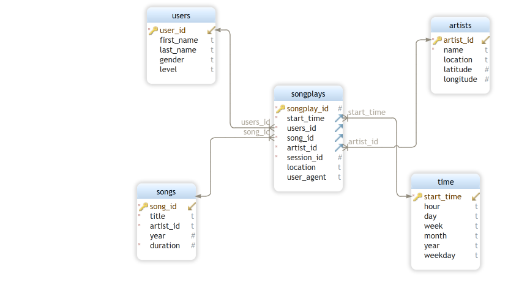

# The Project 1: Data Modeling with PostgreSQL

#### There is a folder _data_ that contain two subfolders song_data and log_data

## song_data

- Each file is in JSON format and contains metadata about a song and the artist of that song. The files are partitioned by the first three letters of each song's track ID
- contain 71 files in json 

## log_dat
This dataset consists of log files in JSON format generated by this event simulator based on the songs in the dataset above. These simulate activity logs from a music streaming app based on specified configurations

## Extra files within the workspace

 - **test.ipynb** displays the first few rows of each table to let you check your database.
 - **create_tables.py** drops and creates your tables. You run this file to reset your tables before  each time you run your ETL scripts.
 - **etl.ipynb** reads and processes a single file from song_data and log_data and loads the data into your tables. This notebook contains detailed instructions on the ETL process for each of the tables.
 - **etl.py** reads and processes files from song_data and log_data and loads them into your tables. You can fill this out based on your work in the ETL notebook.
 - **sql_queries.py** contains all your sql queries, and is imported into the last three files above.
 - **README.md** provides discussion on your project.
 - i have created extra **run_scripts.ipynb** to run the **etl.py,create_tables.py and sql_queries.py**
## Database design

### Fatc table
### songplays table
  - start_time timestamp NOT NULL                         
  - user_id varchar NOT NULL
  - level varchar NULL
  - song_id varchar NOT NULL
  - artist_id varchar NOT NULL
  - session_id int NOT NULL
  - location varchar NULL
  - user_agent varchar NULL
                                                                 
 ### Dimentions tables
 ### usrs table
  - int PRIMARY KEY UNIQUE NOT NULL
  - first_name varchar NULL
  - last_name varchar NULL
  - gender varchar NULL
  - level varchar NULL

 ### songs table
  - varchar PRIMARY KEY UNIQUE NOT NULL
  - title varchar NOT NULL
  - artist_id varchar NOT NULL
  - year int NULL
  - duration float8 NOT NULL
 
 ### artists table
  - artist_id varchar PRIMARY KEY UNIQUE NOT NULL
  - name varchar NOT NULL
  - location varchar NULL
  - latitude float8 NULL
  - longitude float8 NULL
 
 ### time table
 
  - start_time timestamp PRIMARY KEY NOT NULL
  - hour varchar NULL
  - day varchar NULL
  - week varchar NULL
  - month varchar NULL
  - year varchar NULL
  - weekday varchar NULL
  
  ## Project Execuation process

###  - Writing the sql staments in the sql_queries.py python file
### - Execute the script create_tables.py
     - the script creates the database sparkifydb and cals the create_table_queries and drop_table_queries from the sql_queries.py files.
     
     
### - Run the test.ipnb to check if the queries execute as required.

### - Complete the etl.ipynb as required and should work without errors.

### - use the etl.ipynb to complete the etl.py python file script.

### run the sanity section of the test.ipynb to ensure that all best practise are adthered to.

**NOTE** :All works well without erros, submitting the project.

## Conclusion:
The project is sufficent for the sparkify owners to be able to run queries and analyse the data what gographical location had most listeners. s
